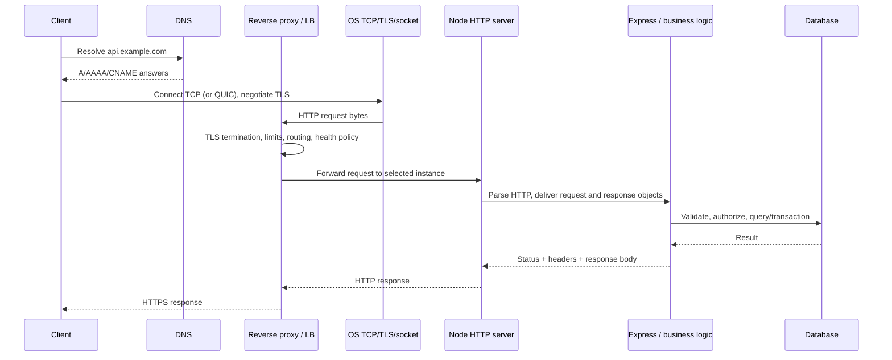

# Module 2 — HTTP, networking, and a raw Node server

[← Module 1](01-node-runtime.md) · [Course home](../README.md) · Next: [Express 5 →](03-express5.md)

## Concept — HTTP is a protocol, not a route callback

An HTTP request has a method, target, headers, and sometimes a body. A response has a status, headers, and sometimes a body. HTTP/1.1 commonly travels over TCP; TLS adds confidentiality, integrity, and server identity (and optionally client identity). HTTP/2 multiplexes streams over a TCP connection; HTTP/3 uses QUIC over UDP. Express is normally above Node's HTTP server and does not replace DNS, TCP, TLS, reverse proxies, or the HTTP specification.

```text
Client → DNS resolver → IP address
       → TCP connection (HTTP/1.1, HTTP/2) or QUIC connection (HTTP/3)
       → TLS handshake for HTTPS
       → HTTP request/response exchanges
```

DNS answers map names to records/addresses; DNS is not a reliable identity check or an authorization mechanism. TCP provides ordered byte-stream delivery and connection state, not message boundaries. HTTP defines message semantics. TLS authenticates/encrypts a channel, but application authorization still happens in the service.

### Request and response anatomy

```http
POST /api/v1/orders?expand=items HTTP/1.1
Host: api.example.test
Accept: application/json
Content-Type: application/json
Authorization: Bearer <redacted>
Idempotency-Key: 7e83...

{"productId":"p_123","quantity":2}
```

```http
HTTP/1.1 201 Created
Content-Type: application/json; charset=utf-8
Location: /api/v1/orders/o_987
Cache-Control: no-store
ETag: "order-v3-o_987"

{"data":{"id":"o_987","status":"pending"}}
```

Headers have different jobs: `Content-Type` describes the sent representation; `Accept` describes acceptable response formats; `Authorization` carries credentials; `Cookie` / `Set-Cookie` carry browser cookie state; `Cache-Control`, `ETag`, and `Last-Modified` govern caching/conditional requests; `Location` identifies a resource or redirect destination; `Retry-After` communicates when a client may retry. Do not confuse content negotiation with input validation.

### Methods and semantics

| Method | Practical intent | Safe? | Idempotent by semantics? |
|---|---|---:|---:|
| GET | Read a representation | Yes | Yes |
| HEAD | GET metadata/headers without response body | Yes | Yes |
| POST | Create/action/submission; often not idempotent without a key | No | Usually no |
| PUT | Replace the target representation | No | Yes when designed correctly |
| PATCH | Apply a partial change | No | Depends on patch semantics |
| DELETE | Remove/deactivate target | No | Usually yes in intended effect, though responses may differ |
| OPTIONS | Discover communication options; browser preflight uses it | Yes | Yes |
| CONNECT | Establish a tunnel through a proxy (conceptual; rarely an application route) | N/A | N/A |
| TRACE | Diagnostic method; commonly disabled to reduce risk | N/A | N/A |

“Safe” and “idempotent” describe intended semantics, not a promise that implementations have no side effects. Do not mutate records during GET. For payment/order POSTs, use idempotency design rather than pretending POST itself is retry-safe.

### Practical status code choices

| Status | Use it for | Common misuse |
|---|---|---|
| 200 | Successful request with a representation | Returning it for a resource creation when `201` + `Location` is clearer |
| 201 | Resource created; ideally include `Location` | Using it when work is only queued and resource does not yet exist |
| 202 | Accepted for asynchronous processing; include status/polling location where useful | Claiming the operation is complete |
| 204 | Success with no response body | Sending JSON after 204 |
| 301 / 302 | Permanent / temporary redirects, mainly browser navigation | Redirecting API callers to an untrusted user-supplied URL |
| 304 | Conditional GET has not changed; no representation body | Treating it as an ordinary API success body |
| 400 | Malformed request or generic invalid request under chosen policy | Using it for every domain conflict or validation failure without an error contract |
| 401 | Credentials absent/invalid; authenticate challenge may be relevant | Using it when a signed-in principal lacks permission (usually 403) |
| 403 | Principal is known but action is forbidden | Using it where hiding resource existence is an intentional 404 policy (document consistently) |
| 404 | No route/resource found or existence intentionally concealed | Returning raw database errors |
| 405 | Method not supported for a known resource; include `Allow` | Returning 404 for a supported path with unsupported method in a mature API |
| 409 | Conflict with current resource state/unique business invariant | Using it for ordinary malformed JSON |
| 415 | Unsupported request media type | Treating an unsupported content type as a field validation error |
| 422 | Syntactically understood request that fails semantic validation (one common policy) | Mixing 400/422 arbitrarily without documented contract |
| 429 | Rate limit/quota exceeded; may include `Retry-After` | Rate limiting only by an untrusted forwarded header |
| 500 | Unexpected server failure | Returning exception messages/stack traces to production clients |
| 502 | Proxy/gateway got invalid upstream response | Mislabeling the app's own validation error |
| 503 | Temporarily unavailable / overloaded / maintenance; optional `Retry-After` | Retrying indefinitely without client guidance |
| 504 | Gateway/upstream timed out | Hiding which timeout budget was exceeded in telemetry |

Use consistent structured errors and a documented policy for 400 vs 422. A status alone is not an API contract.

## Request lifecycle across network and application



A proxy may change the connection peer and add forwarded headers. Express must trust only known proxy hops; otherwise `req.ip`, `req.protocol`, secure cookies, and IP rate limiting can be spoofed. That configuration is a security boundary, not a convenience setting.

## Code — raw Node HTTP server before Express

This deliberately small server makes the Node abstractions visible: `IncomingMessage` is a readable request stream; `ServerResponse` is a writable response. It protects against a body that exceeds 64 KiB and rejects unexpected content types. It is still not a production framework: errors, routes, observability, content negotiation, and validation grow quickly.

```ts
// raw-server.ts — Node 24, ESM TypeScript; compile with tsc before running.
import { createServer } from "node:http";

const MAX_BODY_BYTES = 64 * 1024;

async function readJsonBody(request: AsyncIterable<Uint8Array>): Promise<unknown> {
  const chunks: Buffer[] = [];
  let total = 0;
  for await (const chunk of request) {
    const bytes = Buffer.from(chunk);
    total += bytes.byteLength;
    if (total > MAX_BODY_BYTES) throw Object.assign(new Error("Payload too large"), { status: 413 });
    chunks.push(bytes);
  }
  const text = Buffer.concat(chunks).toString("utf8");
  return JSON.parse(text) as unknown;
}

const server = createServer(async (req, res) => {
  try {
    const url = new URL(req.url ?? "/", "http://localhost");
    res.setHeader("X-Content-Type-Options", "nosniff");

    if (req.method === "GET" && url.pathname === "/health") {
      res.writeHead(200, { "content-type": "application/json; charset=utf-8" });
      res.end(JSON.stringify({ status: "ok" }));
      return;
    }

    if (req.method === "POST" && url.pathname === "/echo") {
      const mediaType = req.headers["content-type"]?.split(";")[0]?.trim().toLowerCase();
      if (mediaType !== "application/json") {
        res.writeHead(415, { "content-type": "application/json" });
        res.end(JSON.stringify({ error: { code: "UNSUPPORTED_MEDIA_TYPE" } }));
        return;
      }
      const body = await readJsonBody(req);
      // In a real service, validate body from unknown with a runtime schema.
      res.writeHead(200, { "content-type": "application/json; charset=utf-8" });
      res.end(JSON.stringify({ data: body }));
      return;
    }

    res.writeHead(404, { "content-type": "application/json" });
    res.end(JSON.stringify({ error: { code: "NOT_FOUND" } }));
  } catch (error) {
    const status = typeof error === "object" && error !== null && "status" in error
      ? Number(error.status) : 400;
    if (res.headersSent) {
      res.destroy(error instanceof Error ? error : undefined);
      return;
    }
    res.writeHead(status, { "content-type": "application/json" });
    res.end(JSON.stringify({ error: { code: status === 413 ? "PAYLOAD_TOO_LARGE" : "INVALID_JSON" } }));
  }
});

server.requestTimeout = 30_000;
server.headersTimeout = 10_000;
server.keepAliveTimeout = 5_000;
server.listen(3000, "0.0.0.0", () => console.log("listening on :3000"));
```

`requestTimeout`, `headersTimeout`, and `keepAliveTimeout` are different controls. Set values based on the proxy and actual request profile; a timeout that is too short breaks legitimate uploads, while an unbounded request can tie up sockets. The snippet's `JSON.parse` can throw; a production implementation also needs clearer 400/413/415 mapping, route composition, abort handling, runtime schema validation, safe logging, and deliberate connection shutdown.

### Why Express exists

Express supplies useful request/response abstractions and a composable ordered middleware/router system: route matching, mount paths, parameters, helpers such as `res.json`, standard error flow, and integration with ecosystem middleware. You still own security policy, runtime validation, authorization, business invariants, persistence, error mapping, limits, shutdown, and observability. Framework abstraction does not make a dangerous query safe.

## Cache and conditional request mini-lesson

A public, stable representation may use `Cache-Control: public, max-age=...`; personalized responses usually need `private` or `no-store`. `ETag` is a validator, not a cache itself: clients can send `If-None-Match`, and an unchanged representation can receive `304`. `Last-Modified` / `If-Modified-Since` use time granularity and can be less precise. Cache keys must account for representation variation (`Vary: Accept-Encoding`, for example) and tenant/user context—never leak tenant-specific content from a shared cache.

## Old vs modern

> **Old tutorials may show:** treating HTTP as “a URL that runs a function,” hardcoding success status 200, ignoring `Content-Type`, buffering unlimited request bodies, using `req.connection` for new code, and trusting every forwarded IP header.
>
> **Modern approach:** learn `node:http` / `IncomingMessage` / `ServerResponse`, set explicit status and headers, bound and validate bytes, design retry/idempotency semantics, handle proxy boundaries, and let Express provide routing/middleware after understanding the underlying protocol.

## Common mistakes

- Treating TCP as a message protocol instead of an ordered byte stream.
- Treating TLS as authorization or assuming HTTPS makes malicious input trustworthy.
- Sending bodies with 204 or confusing 202 accepted with completed.
- Using 401 and 403 interchangeably.
- Forgetting `Location` on resource creation or `Retry-After` on throttling.
- Assuming GET is harmless if its handler mutates state.
- Caching private data without tenant/user variation.
- Parsing a request body without a limit or schema.

## Security notes

Use HTTPS/TLS at the edge, reject unexpected content types, cap headers and body sizes at proxy and application layers, avoid open redirects, validate URL/host input, apply safe cache directives, and never expose request credentials in logs. Test size limits and slow-client behavior. For webhooks, raw bytes may be necessary for signature verification; preserve exact bytes before JSON parsing.

## Exercises

- **Beginner:** classify each method/status in five sample API calls and justify safe/idempotent behavior.
- **Intermediate:** implement `GET /items/:id` with ETag and `If-None-Match`; test 200 and 304.
- **Production:** define timeout budgets for browser → proxy → API → DB → third-party service; show how each deadline leaves time to respond.
- **Debugging:** a client reports duplicate orders after retrying a timed-out POST. Reproduce the timeline and design an idempotency key, not just a longer timeout.
- **Architecture:** choose which layer owns TLS, body limits, compression, caching, request IDs, and load balancing. Explain what must also exist in the app.

## Build this yourself before looking at a solution

Extend the raw server with `GET /products?limit=...`, validated integer bounds, a 405 response with `Allow`, and a bounded POST body. Include tests for malformed JSON, an unsupported media type, 65 KiB body, unknown route, query parsing, and an aborted client. **Expected architecture:** protocol parsing separated from domain logic; no unbounded buffering; intentional status/header policy. **Code review:** test missing headers and partial/disconnected requests, not only happy path.

## Official documentation

- [Node HTTP API](https://nodejs.org/docs/latest-v24.x/api/http.html) · [HTTPS API](https://nodejs.org/docs/latest-v24.x/api/https.html) · [URL API](https://nodejs.org/docs/latest-v24.x/api/url.html)
- [HTTP Semantics RFC 9110](https://www.rfc-editor.org/rfc/rfc9110) · [HTTP/1.1 RFC 9112](https://www.rfc-editor.org/rfc/rfc9112) · [HTTP/2 RFC 9113](https://www.rfc-editor.org/rfc/rfc9113) · [HTTP/3 RFC 9114](https://www.rfc-editor.org/rfc/rfc9114)
- [DNS overview / RFC 1034](https://www.rfc-editor.org/rfc/rfc1034) · [TLS 1.3 RFC 8446](https://www.rfc-editor.org/rfc/rfc8446)
- [HTTP caching RFC 9111](https://www.rfc-editor.org/rfc/rfc9111) · [Node streams](https://nodejs.org/docs/latest-v24.x/api/stream.html)

## What I should know before continuing

You can read request/response messages, explain methods and status semantics, describe the DNS → connection → proxy → Node path, apply request-size/time limits, explain an ETag/304, and build a minimal Node server without confusing protocol code with domain logic. Next: [Module 3 — Express 5](03-express5.md).
