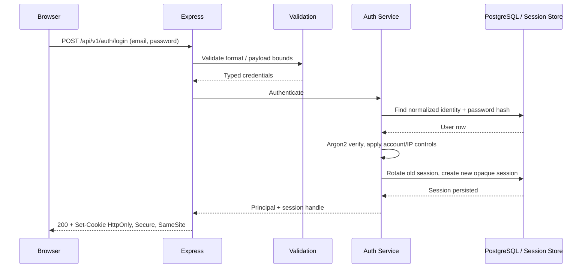
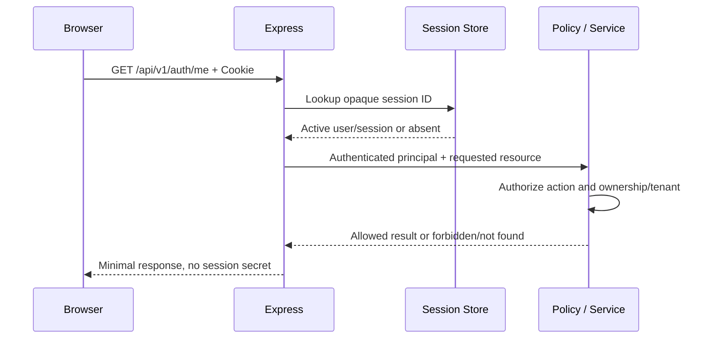
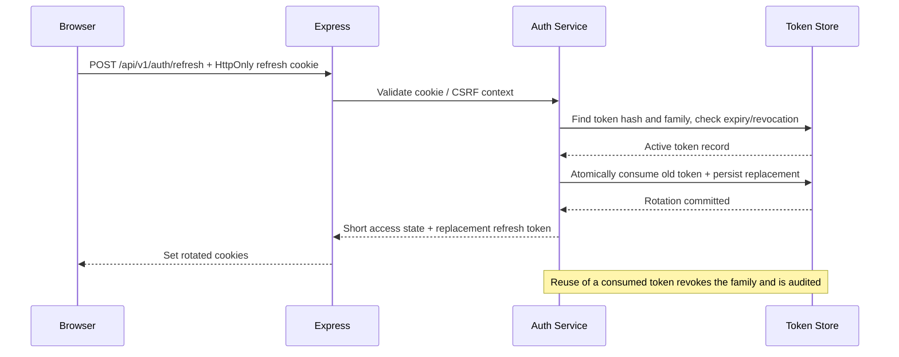
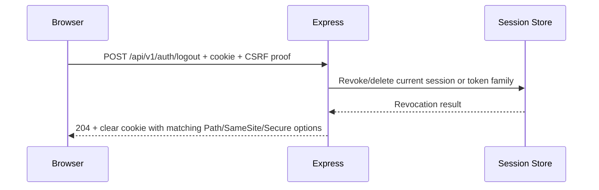
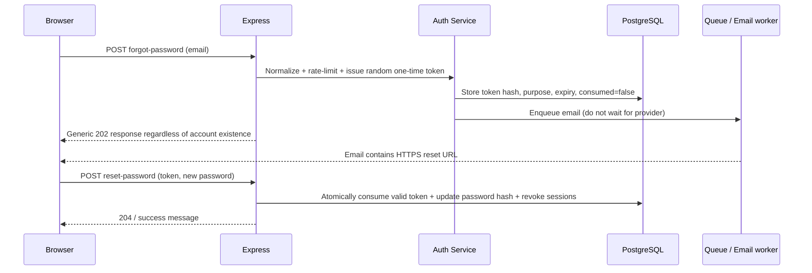

# Module 6 — Authentication, cookies, sessions, JWT, and security

[← Module 5](05-postgres-sql-transactions.md) · [Course home](../README.md) · Next: [Authorization and multi-tenancy →](07-authorization-multitenancy.md)

**Snapshot:** Express 5.2.1; Helmet 8.3.0; `argon2` 0.45.1; `express-session` 1.19.0 (if using server-side sessions); `connect-pg-simple` 10.0.0 (PostgreSQL store option). `cors` 2.8.6 is optional browser-policy middleware. Versions came from the registry; verify official library guidance and compatibility again before adopting. Never use default in-memory session storage in horizontally scaled production.

## Concept — identity, authentication, authorization

- **Identity:** which user/service principal is being represented?
- **Authentication:** what evidence proves control of that identity now?
- **Authorization:** may that authenticated principal perform this action on this resource in this tenant?

An authenticated user is not an authorized user. A valid JWT does not prove ownership of `orderId`. The authorization module adds policy and database scoping; this module establishes how identity is represented and protected.

## Password security

Never store plaintext passwords or reversibly encrypted password values. Use a maintained password-hashing function designed to be expensive (Argon2id is a strong modern default; bcrypt may be retained for compatibility). A per-password salt is part of the encoding; work/memory cost must be benchmarked on production hardware. Do not confuse password hashing with fast SHA-256. Never invent your own hash scheme.

```ts
import argon2 from "argon2";

export async function hashPassword(password: string): Promise<string> {
  return argon2.hash(password, { type: argon2.argon2id });
}

export async function verifyPassword(hash: string, password: string): Promise<boolean> {
  return argon2.verify(hash, password);
}
```

Tune cost to meet your latency/security budget without letting unbounded login attempts consume CPU/memory. Add route-level/account/IP/velocity controls. Use a password policy that favors length and breached-password screening; avoid arbitrary composition rules that encourage predictable passwords. Return generic login/reset responses to reduce account enumeration. Rate-limit password reset and verification flows too.

## Session mental model

```text
Browser keeps an opaque, random session ID in a cookie
             ↓ HTTPS request sends cookie automatically
Express verifies session ID and loads server-side session record
             ↓
API derives principal / permissions from current valid session
```

The cookie should hold an opaque random ID, not a whole editable user object. Server-side storage can be PostgreSQL or Redis. `express-session`'s default MemoryStore is for development only: it is not shared among instances, does not survive restart, and is not designed for production. Rotate the session ID after login/privilege change; revoke on logout/password reset; expire idle and absolute lifetimes; store only minimal data.

```ts
// Illustrative cookie policy. Actual session middleware/store wiring is configured separately.
res.cookie("__Host-sid", sessionId, {
  httpOnly: true,
  secure: true,          // production HTTPS; local HTTP needs an environment-specific setup
  sameSite: "lax",       // choose based on front-end/API site relationship
  path: "/",
  maxAge: 30 * 60 * 1000,
  // __Host- prefix requires Secure, Path=/, and no Domain attribute.
});
```

Cookie properties: `HttpOnly` blocks ordinary JavaScript access; `Secure` limits transmission to HTTPS; `SameSite` controls cross-site cookie sending; `Domain` broadens subdomain scope (omit unless required); `Path` limits path applicability; expiry controls duration. These reduce risk but do not eliminate XSS/CSRF/session theft.

## Session auth vs JWT

| Server-side session cookie | JWT access/refresh token |
|---|---|
| Small opaque cookie; server controls session and revocation centrally | Signed claims can be verified locally by multiple services; useful when that independence is needed |
| Simple immediate logout/revocation and permission refresh | Self-contained access token can remain valid until expiry unless revocation/version checks exist |
| Requires shared durable session store when scaled horizontally | Requires signing key management, audience/issuer validation, algorithm allowlist, rotation/revocation/replay defenses |
| Cookies are automatically attached by browsers, so CSRF policy matters | A bearer token sent in Authorization header is not automatically sent cross-site by a browser; token storage/XSS threats remain. Cookie-stored JWTs still require CSRF analysis |
| Often best for first-party browser app | Not automatically better or stateless in a complete production architecture |

**Course choice:** build secure server-side sessions first to teach revocation and cookie boundaries. Then evaluate a production access/refresh design. Do not put long-lived tokens in `localStorage` as the default browser recommendation.

## JWT anatomy and production considerations

A JWT commonly has a JOSE header, a payload of claims, and a signature/MAC over encoded data. Base64url encoding is not encryption. Validate allowed algorithms, signature, issuer (`iss`), audience (`aud`), subject (`sub`), expiry (`exp`), not-before (`nbf`) where applicable, token type and key ID/rotation policy. Do not trust claims just because they decode.

- **Access token:** short lifetime; scoped to an API/resource/audience; minimize sensitive claims.
- **Refresh token:** longer-lived credential used only to obtain replacement access state; store hashed token identifier/record server-side, rotate on each use, link token family, detect reuse, revoke the family on reuse/logout/security event.
- **Key management:** keep private/signing secrets in a secret manager; rotate by key ID and overlapping verification keys; do not select arbitrary algorithms from the untrusted token header.
- **Replay:** a stolen bearer credential can be replayed until expired/revoked. TLS, short expiry, HttpOnly cookie, rotation and anomaly/reuse checks limit impact.

If JWT is in an HttpOnly cookie, browser cookies are still ambient credentials. Apply CSRF protections and exact CORS policy. If refresh token is a cookie and frontend is cross-site, cookie attributes and CSRF tokens must be designed for that deployment topology.

## Required auth sequence diagrams

### Login



### Authenticated request



### Refresh-token rotation (alternative token architecture)



### Logout and session revocation



### Password reset / email verification



Email verification follows the same one-time, hashed, purpose-bound, expiring token pattern. Do not let a reset link act as a general login token.

## Browser frontend integration

A same-origin React/Next/Astro/TanStack Start frontend can rely on the browser to send an HttpOnly cookie; JavaScript must not read/copy the cookie. For a separate frontend origin, browser fetch must opt into credentials and the API must return an exact CORS origin plus `Access-Control-Allow-Credentials`; unsafe cookie-authenticated requests also need the selected CSRF proof.

```ts
const response = await fetch("https://api.example.com/api/v1/auth/me", {
  credentials: "include",
  headers: { accept: "application/json" },
});
if (response.status === 401) {
  // Show signed-out state; don't loop refresh indefinitely.
}
if (!response.ok) throw new Error("Could not load account");
const payload: unknown = await response.json();
// Validate/parse response if runtime integrity is required by this client.
```

For same-origin frontends use relative API URLs and avoid CORS entirely. Never call `localhost` from a deployed browser to reach a sandbox/server. For cookie auth, don't assume the frontend can attach a custom `Authorization` header to native EventSource; use a same-origin cookie stream or a carefully scoped short-lived stream credential.

## CSRF vs CORS vs XSS

- **CSRF:** attacker causes a victim browser to make a request that carries ambient credentials (often cookies). Defenses include `SameSite`, CSRF tokens/double-submit pattern, Origin/Referer validation, and avoiding state changes on safe methods. Choose defense based on browser/app topology.
- **CORS:** browser policy controlling whether frontend JavaScript can read a cross-origin response. It does not authenticate users, authorize API operations, or stop curl/server-to-server calls. A restrictive CORS policy is useful, but not an authorization system.
- **XSS:** attacker-controlled script executes in an origin; it can issue authenticated requests and exfiltrate data accessible to JS. HttpOnly prevents reading a cookie but does not stop malicious same-origin JS from using the session.

Cookie auth implies explicit CSRF analysis. `SameSite=Lax` helps for common same-site browser flows but is not a universal CSRF proof, especially with cross-site deployment, unsafe GETs, browser differences, or sibling subdomain assumptions.

## CORS configuration (browser boundary only)

Allow exact known origins, methods and headers. If credentials are included, do not use `Access-Control-Allow-Origin: *`; return an explicit origin and `Access-Control-Allow-Credentials: true`. Support preflight `OPTIONS` correctly. Validate `Origin` against normalized allowlist; do not reflect arbitrary origins.

```ts
import cors from "cors";

const allowedOrigins = new Set(["https://app.example.com"]);
app.use(cors({
  origin(origin, callback) {
    // Server-to-server clients may have no Origin; CORS is only a browser policy.
    if (!origin || allowedOrigins.has(origin)) return callback(null, true);
    return callback(null, false);
  },
  credentials: true,
  methods: ["GET", "POST", "PATCH", "DELETE", "OPTIONS"],
  allowedHeaders: ["Content-Type", "X-CSRF-Token", "Idempotency-Key"],
  maxAge: 600,
}));
```

A rejected browser origin receives no permissive CORS headers; the request may still reach the server and non-browser clients can call the API. This is not an auth middleware. Never use CORS callback success as permission to access a resource.

## Security headers, Helmet, and OWASP

Express's production guidance recommends TLS, input validation, secure cookies, Helmet, brute-force protection, and dependency hygiene. Helmet 8.3.0 sets a group of security headers; understand application needs rather than turning every browser isolation header on without checking integrations.

- **CSP:** controls which resources a browser document may load; can reduce XSS impact, but needs app-specific policy.
- **HSTS:** tells browsers to prefer HTTPS; only enable with correct TLS/proxy deployment and carefully decide `includeSubDomains`/preload.
- **X-Content-Type-Options: nosniff:** reduces MIME sniffing.
- **Referrer-Policy:** limits referrer leakage.
- **COOP/CORP/COEP:** browser process/resource isolation controls; validate cross-origin resource needs.
- Disable `X-Powered-By`; it has limited security impact but reduces trivial fingerprinting.

Use the current OWASP Top 10/ASVS and threat-model-specific controls. Core topics: broken access control, authentication failures, injection, cryptographic failures, insecure design, security misconfiguration, vulnerable components, logging/monitoring failures, SSRF, and client-side XSS/CSRF. OWASP lists are risk education, not proof a system is secure.

## Brute force and rate limits

Protect login and password reset with combined IP, account identifier (carefully hashed/normalized), device/session signals, and velocity. Avoid permanent account lockout that an attacker can weaponize to deny service. Use exponential delay or temporary throttling, generic errors, audit signals, and risk-appropriate MFA for admin actions. Distributed deployments need a shared rate-limit store (Redis or gateway); IP-based controls depend on trusted proxy configuration.

## Bad → better

**BAD:** store a password in a column; put a long-lived JWT in localStorage; treat decoded claims as trusted; keep sessions in process memory; return “email not found” for reset; accept wildcard CORS with credentials; disable CSRF because “we use CORS.”

**BETTER:** Argon2id hash; server-side session with rotation/revocation or a deliberate short-access/rotating-refresh design; verify cryptographic and semantic claims; shared session storage; generic reset response; exact browser origins; CSRF design for cookie credentials; authorization on every resource.

## Common mistakes

- Login does not regenerate the session ID (session fixation).
- Logout only clears the browser cookie but leaves a valid server-side session.
- Password reset changes password but leaves attacker sessions valid.
- Refresh rotation is not atomic; two parallel refreshes both succeed.
- JWT `aud`, `iss`, expiry or algorithm are not verified.
- Cookies are set without `Secure` behind an untrusted proxy configuration.
- Reset tokens are stored in plaintext or are reusable/non-expiring.
- CORS is used instead of route/service authorization.
- Auth logs contain credentials, cookies, bearer tokens or reset links.

## Security review checklist

Can an attacker brute-force an account, enumerate email addresses, abuse reset/verification, reuse a refresh token, steal/replay a session, bypass CSRF, exploit XSS, forge a token by algorithm/key confusion, or access another tenant? Can a malformed payload create resource exhaustion? Are cookies actually Secure at the proxy boundary? Are secrets redacted from logs and error reports?

## Exercises

- **Beginner:** diagram browser cookie storage and a request with HttpOnly session cookie; explain what HttpOnly does not prevent.
- **Intermediate:** implement password hash/verify and tests; write reset flow with generic responses and one-time token hashing.
- **Production:** compare session vs access/refresh architecture for a same-site SPA and a separate-site frontend; specify cookie/CORS/CSRF choices.
- **Debugging:** reproduce a logout that clears only the cookie but leaves the session active; add revocation and test parallel refresh replay.
- **Architecture:** choose session storage and revocation strategy for 5 API replicas, admin sessions, and a queue worker; define failure behavior if Redis is down.

## Build this yourself before looking at a solution

Design registration, login, current-user, logout, reset and verification before coding. List every secret and its storage, every token/session expiry and rotation point, rate-limit dimensions, cookie flags, CSRF assumption, session store, and audit events. **Expected architecture:** auth service owns credential/session lifecycle; controllers own HTTP; business authorization remains separate. **Review:** inspect every response/log for account enumeration and credential leakage.

## Official documentation and standards

- [Express production security](https://expressjs.com/en/advanced/best-practice-security.html) · [Helmet](https://helmetjs.github.io/) · [express-session](https://github.com/expressjs/session) · [PostgreSQL session store](https://github.com/voxpelli/node-connect-pg-simple)
- [Argon2 Node package/API](https://github.com/ranisalt/node-argon2) · [OWASP Password Storage Cheat Sheet](https://cheatsheetseries.owasp.org/cheatsheets/Password_Storage_Cheat_Sheet.html) · [Authentication Cheat Sheet](https://cheatsheetseries.owasp.org/cheatsheets/Authentication_Cheat_Sheet.html)
- [OWASP CSRF](https://cheatsheetseries.owasp.org/cheatsheets/Cross-Site_Request_Forgery_Prevention_Cheat_Sheet.html) · [CORS MDN overview](https://developer.mozilla.org/en-US/docs/Web/HTTP/CORS)
- [JWT RFC 7519](https://www.rfc-editor.org/rfc/rfc7519) · [OAuth 2.0 Security Best Current Practice RFC 9700](https://www.rfc-editor.org/rfc/rfc9700)
- [OWASP Top 10](https://owasp.org/www-project-top-ten/) · [OWASP ASVS](https://owasp.org/www-project-application-security-verification-standard/)

## What I should know before continuing

You can implement password hashing without plaintext storage; explain session/JWT tradeoffs; design secure cookie, logout, reset and refresh rotation; distinguish CSRF, CORS and XSS; explain why access tokens require full claim validation; and describe how session state scales. Next: [Module 7 — Authorization and multi-tenancy](07-authorization-multitenancy.md).
