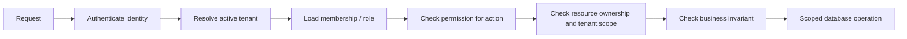

# Module 7 — Authorization, RBAC, and multi-tenant isolation

[← Module 6](06-auth-security.md) · [Course home](../README.md) · Next: [Redis, caches and queues →](08-redis-cache-queues.md)

## Concept — permissions are evaluated against a resource

Authentication establishes a principal. Authorization evaluates principal + action + resource + tenant + business state. A role is a convenient grouping of permissions, not a complete authorization policy. “Owner” may manage a specific organization but must not manage every organization in the system.



### Practical roles and permissions

| Role | Example grants |
|---|---|
| User | Read/edit own profile; create orders; read/cancel own eligible orders |
| Admin | Manage users/products/orders; view analytics within permitted global/admin scope; administrative actions audited |
| Organization Owner | Manage this organization, invite members, assign allowed roles, manage billing for this organization |
| Organization Member | Permissions assigned by membership; no implicit access to other tenants |

Use a stable permission vocabulary such as `products:read`, `products:write`, `orders:read`, `orders:cancel`, `members:invite`, `billing:manage`. Do not accept arbitrary role names from client requests.

## Data model and membership

```sql
CREATE TABLE memberships (
  organization_id uuid NOT NULL REFERENCES organizations(id),
  user_id uuid NOT NULL REFERENCES users(id),
  role text NOT NULL CHECK (role IN ('owner', 'admin', 'member')),
  status text NOT NULL CHECK (status IN ('invited', 'active', 'suspended')),
  created_at timestamptz NOT NULL DEFAULT now(),
  PRIMARY KEY (organization_id, user_id)
);

CREATE TABLE orders (
  id uuid PRIMARY KEY,
  organization_id uuid NOT NULL REFERENCES organizations(id),
  customer_id uuid NOT NULL REFERENCES users(id),
  status text NOT NULL,
  total_cents integer NOT NULL CHECK (total_cents >= 0),
  created_at timestamptz NOT NULL DEFAULT now()
);

CREATE INDEX orders_org_created_idx
  ON orders (organization_id, created_at DESC, id DESC);
```

The active tenant should come from authenticated membership/validated request context, not a `organizationId` body field that the user can choose. A subdomain/header may request a tenant context, but the service must prove membership and permission before operating there. Every tenant-owned query includes tenant ID and resource ID.

## Authorization at three levels

1. **Route-level:** is this endpoint available to an authenticated role? Useful coarse filter, not final proof.
2. **Service-level:** does this principal satisfy business policy for this use case? Testable without Express.
3. **Data-level:** does the query itself scope resource by tenant/owner? Prevents forgotten checks and reduces unsafe object loading.

```ts
// BAD: the route has authentication, but the lookup is global and no ownership is checked.
const order = await prisma.order.findUnique({ where: { id: orderId } });
return order;

// GOOD: tenant/owner is part of the database predicate.
const order = await prisma.order.findFirst({
  where: {
    id: orderId,
    organizationId: context.organizationId,
    ...(context.permissions.has("orders:read:any")
      ? {}
      : { customerId: context.userId }),
  },
  select: { id: true, status: true, totalCents: true, createdAt: true },
});
if (!order) throw new NotFoundError("Order");
```

Returning 404 for a cross-tenant resource can avoid disclosing existence; returning 403 can be appropriate when the caller is allowed to know the resource exists. Pick a consistent policy and avoid different behavior that leaks resource IDs.

### Service policy, not giant route checks

```ts
export type Principal = {
  userId: string;
  organizationId: string;
  role: "owner" | "admin" | "member";
  permissions: ReadonlySet<string>;
};

export function canCancelOrder(
  principal: Principal,
  order: { customerId: string; status: string; organizationId: string },
): boolean {
  if (principal.organizationId !== order.organizationId) return false;
  if (principal.permissions.has("orders:cancel:any")) return order.status === "pending";
  return principal.userId === order.customerId && order.status === "pending";
}
```

Keep authorization decisions close to the use case. A route-level `requireRole("admin")` is useful for the admin namespace, but cannot answer resource ownership or order-state questions alone. For high-risk writes, make the database predicate carry tenant/resource conditions and enforce uniqueness/ownership with constraints where possible.

## Tenant isolation mental model

```text
Request → verified user/session → requested tenant context
        → active membership + policy → scoped service input
        → query predicate includes tenant → response is tenant-minimal
```

A reusable repository can require the tenant parameter instead of making it optional. Avoid a “global admin” bypass that every query can accidentally use. Use tenant-specific background-job payloads and verify them again in workers. Cache keys, object-storage paths, rate-limit counters, audit entries, websocket/SSE subscriptions and search indexes all require tenant-aware scope.

Database row-level security (RLS) can provide defense in depth, but is not a substitute for application authorization. With pooled connections, set tenant context safely per transaction and ensure it cannot leak to the next request; test RLS with the real runtime DB role, not a superuser that bypasses policies.

## Express types and request context

Declaration merging can express properties that middleware guarantees:

```ts
// src/types/express.d.ts
import type { Principal } from "../modules/auth/principal.js";

declare global {
  namespace Express {
    interface Request {
      requestId: string;
      principal?: Principal;
      tenantId?: string;
    }
  }
}

export {};
```

The optional fields are intentional: middleware can fail before they exist. Do not annotate `principal` as always present and then access it in a public route. Prefer a helper that narrows:

```ts
function requirePrincipal(req: Express.Request): Principal {
  if (!req.principal) throw new UnauthorizedError();
  return req.principal;
}
```

Runtime middleware must set and validate the property; the `.d.ts` file does not. A more explicit `res.locals` context also works. Do not use declaration merging to hide ordering bugs.

## Invitations, ownership changes, and audit

Invitations should be bound to organization, invitee or email, allowed role, expiration, one-time token hash, and creator. Accepting an invitation must atomically consume it and create/activate membership under constraints. Role changes should reject privilege escalation (e.g. a member cannot assign owner), prevent removing the last owner, require fresh/step-up authentication for billing/owner changes as appropriate, and create audit events containing actor, tenant, action, resource, request ID, time, and result—but no secrets.

## Common mistakes

- Assuming authenticated means authorized.
- Checking a role but forgetting the requested resource's tenant/owner.
- Loading a global object and forgetting the second permission check.
- Trusting `organizationId` in a body/query/header without membership validation.
- Reusing a cache key or storage key without tenant scope.
- Treating the role string as a universal permission policy.
- Passing an admin boolean through many functions with no audit trail.
- Running RLS tests as database superuser, which bypasses policies.
- Assuming Express type augmentation adds data at runtime.

## Security / performance review

For every tenant-scoped endpoint ask: where did tenant identity come from; what proves membership; what permission is needed; does SQL include both resource ID and tenant ID; can a cache/object key cross tenants; can a queue worker be tricked into another tenant; is the result minimized; is the administrative action audited? Index `(organization_id, ...)` for common scoped lookups and verify with a query plan.

## Exercises

- **Beginner:** map roles to permissions for organization owner/member/platform admin.
- **Intermediate:** implement and unit-test `canCancelOrder` across tenant, owner, status and admin cases.
- **Production:** implement organization invitation accept transaction with single-use token, expiry, role cap and audit event.
- **Debugging:** demonstrate insecure direct object reference with `findUnique({ id })`; make the cross-tenant regression test fail before the fix and pass afterward.
- **Architecture:** design tenant propagation to HTTP, DB transaction, Redis cache, object storage, queue jobs and realtime subscribers. Identify where each boundary revalidates.

## Build this yourself before looking at a solution

Create `GET /organizations/:id/orders/:orderId` and `POST /organizations/:id/invitations`. Implement a test matrix covering no session, non-member, wrong tenant, member read, owner invite, member invite denied, last-owner protection. **Expected architecture:** policy is testable outside Express, repository queries are tenant-scoped, and audit events are emitted for privileged changes. **Review:** test both route and direct service invocation so policy cannot be bypassed by another caller.

## Official documentation

- [OWASP Authorization Cheat Sheet](https://cheatsheetseries.owasp.org/cheatsheets/Authorization_Cheat_Sheet.html) · [Multi-Tenant Application Security Cheat Sheet](https://cheatsheetseries.owasp.org/cheatsheets/Multi_Tenant_Security_Cheat_Sheet.html)
- [PostgreSQL row security policies](https://www.postgresql.org/docs/18/ddl-rowsecurity.html) · [PostgreSQL transaction isolation](https://www.postgresql.org/docs/18/transaction-iso.html)
- [TypeScript declaration merging](https://www.typescriptlang.org/docs/handbook/declaration-merging.html) · [Express request API](https://expressjs.com/en/5x/api.html#req)
- [Prisma transactions](https://www.prisma.io/docs/orm/v7/prisma-client/queries/transactions)

## What I should know before continuing

You can distinguish role checks from resource policy, enforce ownership/tenant scope in the data query, trace tenant context through caches/jobs/storage, type request augmentation without pretending it creates runtime state, and test unauthorized/forbidden cases. Next: [Module 8 — Redis, caching and queues](08-redis-cache-queues.md).
