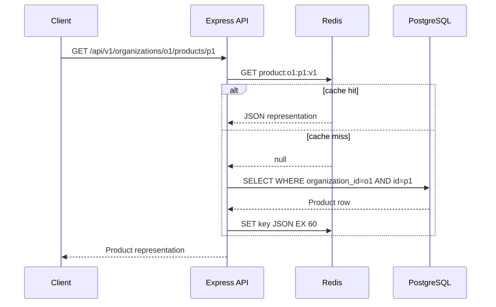

# Module 8 — Redis, cache policy, queues, retries, and distributed reliability

[← Module 7](07-authorization-multitenancy.md) · [Course home](../README.md) · Next: [Streams and integrations →](09-streams-integrations-realtime.md)

**Snapshot:** Redis's recommended Node client is `redis` / node-redis 6.2.1. BullMQ 6.3.9 is the queue snapshot; BullMQ v6 introduced pluggable backends (Redis remains the default/battle-tested backend in its docs; PostgreSQL is an optional backend). Pin versions and follow v6 docs/changelog—do not mix older Bull/BullMQ snippets without checking migrations.

## Redis mental model

Redis is an in-memory data structure server with persistence/configuration choices; it is not automatically the source of truth. It supports strings, hashes, sets, sorted sets, streams, pub/sub, TTLs, atomic commands/scripts, and more. Decide what happens if Redis is empty, stale, full, slow, partitioned, or unavailable.

| Use | Appropriate when | Guardrail |
|---|---|---|
| Cache | Measured repeated reads tolerate staleness | PostgreSQL owns source data; TTL + invalidation + tenant key scope |
| Sessions | Shared low-latency session lookup is useful | Persistence/availability and revocation expectations are explicit |
| Rate limiting | Counters must be shared across API replicas | Trusted client IP/user key; atomic increment/expiry; fail-open/closed policy |
| Queue backend | Durable/retried async jobs fit Redis/BullMQ model | Redis persistence, memory policy, backups/monitoring and idempotent jobs |
| Pub/sub | Ephemeral broadcast/notifications | Pub/sub is not durable; missed offline subscribers do not replay events |
| Distributed lock | A narrow coordination primitive after careful analysis | Lease expiry, fencing tokens and failure model; prefer DB constraints/transactions when sufficient |
| Temporary state | Expiring one-time tokens, short-lived codes | Store hashes for bearer secrets; TTL and purpose/scope checks |

Use PostgreSQL for durable relational truth, joins, constraints, and transactional invariants. Do not add Redis simply because a diagram contains it.

### Core Redis structures and meaning

| Structure | Mental model | Example backend use |
|---|---|---|
| String | One byte/string value with atomic operations and TTL | Cache entry, counter, opaque short-lived token hash |
| Hash | Map of fields under one key | Small session state or compact entity snapshot |
| Set | Unique members, unordered | Membership/feature cohort lookup; not durable authorization truth |
| Sorted set | Members ordered by score | Leaderboard, delayed scheduling/index—beware score/key cardinality |
| Pub/Sub | Live broadcast, no durable replay | Realtime invalidation/fanout when missed messages are recoverable |
| Streams | Append-only-ish entries with IDs and consumer groups | Durable event/job-like processing with explicit trimming/ack/recovery policy |

Every key needs an owner, namespace, TTL or retention policy, maximum-size strategy, and safe eviction behavior. A Redis stream is not automatically a full replacement for a purpose-built queue; consumer group lag, pending entries, claiming, retention and idempotency need operations ownership.

## Cache mental model

```text
Browser cache → CDN/reverse-proxy cache → application cache (Redis)
                                      → database query/result path
```

For each cache specify **what** representation, **where** stored, **TTL**, **invalidation**, **staleness tolerance**, **consistency**, **tenant/user variation**, and **failure behavior**. Caching is a consistency contract, not a speed switch.

### Cache-aside product example



A cache key carries tenant ID; a version prefix supports schema changes; use short TTL; validate cached payloads as data if safety demands it. Avoid caching negative results indefinitely, permission decisions, or large unbounded data without a plan.

```ts
import { createClient } from "redis";

if (!config.redisUrl) throw new Error("Redis is required for this process role");
const redis = createClient({ url: config.redisUrl });
redis.on("error", (error) => logger.error({ error }, "Redis client error"));
await redis.connect();

async function getProduct(organizationId: string, productId: string) {
  const key = `product:v1:${organizationId}:${productId}`;
  const cached = await redis.get(key);
  if (cached !== null) return productCacheSchema.parse(JSON.parse(cached));

  const product = await productRepository.findById({ organizationId, productId });
  if (product) await redis.set(key, JSON.stringify(product), { EX: 60 });
  return product;
}
```

Use JSON serialization for simple examples only; handle Redis errors and cache fallbacks deliberately. Do not let a Redis timeout turn a healthy catalog read into an outage unless policy requires it. For cache writes, a DB commit followed by failed Redis invalidation creates stale cache; versioning/TTL/outbox may be needed for stricter freshness.

### Invalidation strategies

- **TTL:** bounds stale lifetime, simple but permits stale window.
- **Explicit invalidation:** after successful write delete/refresh the relevant key; concurrent readers and write failures still matter.
- **Write-through:** update cache during write; increases coupling/consistency complexity.
- **Cache-aside:** read-through on miss, delete/expire on change; common and simple.
- **Stale-while-revalidate:** serve prior value while refresh occurs; only for data allowed to be stale.

After product update, invalidate tenant-scoped catalog/detail keys and any category/price listing keys. Dashboard aggregates can have a longer TTL and show “updated at”; user permissions usually should not be cached long without reliable revocation/short TTL. Session data needs an explicit revocation policy.

## Redis rate limit counter concept

This unsafe pattern has a race: `GET`, increment in JavaScript, then `SET` loses updates across instances. Use one atomic Redis operation/script/library and set expiry atomically. Dimensions can include route + user ID + trusted IP + tenant. Do not put raw emails/passwords in keys. Decide fail-open versus fail-closed: a public read API may fail open with monitoring; login/expensive sensitive endpoints may need a stricter gateway/app policy. A distributed lock is not a substitute for an idempotency key or transaction.

## Queues: API process versus worker process

```text
Client → API validates request → PostgreSQL commit (order + outbox)
                              → publish job → BullMQ/Redis
                                                  ↓
                                           worker process
                                                  ↓
                                     email / image / reports
```

HTTP handlers should not wait for an email provider, video conversion, or large report. Return 202 when the requested operation itself is still pending; return 201 when the order resource is committed and only the notification is asynchronous. Jobs can be delivered more than once, so workers must be idempotent.

### BullMQ sketch (Redis backend)

```ts
import { Queue, Worker, createNodeRedisClient } from "bullmq";
import { createClient } from "redis";

if (!config.redisUrl) throw new Error("Redis is required for this process role");
const rawRedis = createClient({ url: config.redisUrl }); // rediss:// is handled by node-redis
rawRedis.on("error", (error) => logger.error({ error }, "Redis client error"));
await rawRedis.connect();
const connection = createNodeRedisClient(rawRedis); // BullMQ v6 adapter for node-redis v5+
export const emailQueue = new Queue("transactional-email", { connection });

await emailQueue.add(
  "order-confirmation",
  { orderId, organizationId, requestId }, // no password, token or payment secret
  {
    jobId: `order-confirmation:${orderId}`,
    attempts: 5,
    backoff: { type: "exponential", delay: 1_000 },
    removeOnComplete: { age: 86_400, count: 10_000 },
  },
);

const worker = new Worker(
  "transactional-email",
  async (job) => {
    // Reload minimum data from PostgreSQL and validate tenant/resource state.
    // Provider call has an AbortSignal deadline; sending must be idempotent where possible.
    await emailService.sendOrderConfirmation(job.data);
  },
  { connection, concurrency: 8 },
);

worker.on("failed", (job, error) => {
  logger.error({ jobId: job?.id, name: job?.name, error }, "job failed");
});
```

BullMQ 6 supports Redis-client adapters; its node-redis adapter is the selected path here (`redis` v5+ is required, and the course uses `redis` 6.2.1). Create the client explicitly, adapt it with `createNodeRedisClient`, and follow the v6 `Connections` guide for reconnect behavior and lifecycle. Production API producers and worker consumers normally run as separate process roles and each owns its client/Queue or Worker. Close Worker/Queue objects before shutting down the client. Don't pass `process.env.REDIS_URL!` without startup validation. Keep job payloads compact and versioned; load authoritative data at execution time.

### Transactional outbox

A database commit followed by a queue publish can fail between steps. The **outbox** writes a durable event row in the same PostgreSQL transaction as the order. A separate relay publishes pending rows and marks them delivered; it may publish twice, so consumers deduplicate by event ID. This closes the “DB committed, queue publish lost” gap without pretending a DB and Redis share one atomic transaction.

## Idempotency and delivery semantics

Assume at-least-once attempts: API clients retry, webhooks repeat, workers crash after an external side effect but before acknowledging the job. Idempotency key pattern:

1. Require `Idempotency-Key` for a payment/order endpoint.
2. Scope it to principal/tenant + operation; persist key and canonical request hash with unique constraint.
3. In the same DB transaction, reserve key and create the operation/result.
4. If duplicate with same request hash, return prior result; if same key with different body, reject conflict.
5. Use provider idempotency keys and webhook event ID unique constraints as separate safeguards.

Exactly-once execution across external systems is generally not guaranteed. Aim for at-least-once delivery + idempotent effects + reconciliation.

## Retries, timeouts and circuit breakers

Retries are only safe when the operation is idempotent or protected by deduplication. Use a bounded number of attempts, exponential backoff with jitter, a max elapsed-time budget, and classify permanent errors (bad input/authorization) versus transient failures (timeout/503). Avoid synchronized retry storms.

Circuit breaker states:

```text
CLOSED (calls pass) → failure threshold → OPEN (fail fast)
        ↑                                     ↓ cooldown
        └──────── HALF-OPEN (probe) ←─────────┘
```

Build the policy around a dependency boundary: timeout first, bounded retries if safe, breaker for repeated dependency failure, fallback only if semantically safe. A fake cached price for checkout is not a safe fallback. Return a clear 503/504 where appropriate and preserve core checkout if an optional analytics/email dependency is down.

### Small circuit-breaker example

This teaching implementation shows only a single-process state machine; production use needs concurrency/race behavior, metrics, per-dependency instances and a library/standard policy review. Do not share this mutable state across replicas and assume it is distributed protection.

```ts
type BreakerState = "closed" | "open" | "half-open";

class CircuitBreaker {
  #state: BreakerState = "closed";
  #failures = 0;
  #openedAt = 0;
  constructor(private readonly threshold = 5, private readonly cooldownMs = 10_000) {}

  async execute<T>(operation: () => Promise<T>): Promise<T> {
    if (this.#state === "open") {
      if (Date.now() - this.#openedAt < this.cooldownMs) {
        throw new Error("DEPENDENCY_CIRCUIT_OPEN");
      }
      this.#state = "half-open";
    }
    try {
      const result = await operation();
      this.#failures = 0;
      this.#state = "closed";
      return result;
    } catch (error) {
      this.#failures += 1;
      if (this.#state === "half-open" || this.#failures >= this.threshold) {
        this.#state = "open";
        this.#openedAt = Date.now();
      }
      throw error;
    }
  }
}
```

Pair this with an AbortSignal timeout and bounded safe retries; do not count a validation/4xx response as an availability failure. Production half-open probes should be limited so a recovering service is not flooded.

## Redis down / degradation policy

- Product cache down: bypass cache and query PostgreSQL with DB load protection; expose Redis errors/latency; avoid retry loops.
- Session store down: usually fail closed for protected requests; do not silently authenticate from stale data.
- Rate limit Redis down: choose documented fail-open/closed based on endpoint risk and add an edge fallback/alert.
- Queue unavailable: keep order committed only if the transactional outbox can retain work; otherwise fail before claiming async work accepted.
- Redis memory pressure: monitor evictions and used memory; eviction policy suitable for cache may be unsafe for queue/session keys sharing the same instance. Separate workloads or configure no-eviction/persistence appropriately.

## Old vs modern

> **Old tutorials may show:** process-local `Map` cache, in-memory session, direct email send in a controller, unlimited retries, Redis distributed lock around all writes, or a queue that assumes every job runs exactly once.
>
> **Modern approach:** use shared state intentionally; PostgreSQL is truth; define TTL/invalidation and outage policy; outbox important events; make jobs idempotent; bound retries, timeouts, payloads, concurrency and queue depth.

## Common mistakes

- Cache key omits tenant or representation version.
- Cache invalidation occurs before DB commit.
- Redis cache hit bypasses a current authorization policy.
- Queue payload contains secret tokens or the whole ORM entity.
- Worker assumes exactly-once delivery.
- Job retry recharges or resends without a stable dedupe key.
- Redis outage triggers fallback that overloads PostgreSQL.
- Treating Pub/Sub as a durable queue.
- Retry storm with no jitter/elapsed budget.
- BullMQ v6 code copied from a v5 tutorial without backend API review.

## Exercises

- **Beginner:** implement a 60-second cache-aside read with tenant-specific key and schema validation.
- **Intermediate:** write explicit invalidation behavior for product create/update/delete and list every affected key pattern.
- **Production:** implement order commit + outbox record, relay, worker, retry policy, idempotent email, dead-letter/alert behavior.
- **Debugging:** simulate DB success followed by Redis invalidation failure; observe stale data and fix with versioning/TTL/outbox as requirements dictate.
- **Architecture:** decide behavior for Redis loss separately for cache, session, rate limit, queue and pub/sub; explain why one generic “fallback” is wrong.

## Build this yourself before looking at a solution

Implement a product cache and queued order confirmation. Add concurrent duplicate job delivery, Redis unavailable, provider timeout and worker restart tests. **Expected architecture:** cache is disposable; PostgreSQL is authoritative; queue producer and worker are separate; side effects are idempotent. **Review:** verify tenant scoping in keys and job payload, TTL bounds, retry budget, and shutdown lifecycle.

## Official documentation

- [Redis 8.10 release announcement](https://redis.io/blog/announcing-redis-810-compact-hash-jsonpath-extensions-performance-improvements-and-more/) · [Redis Node client](https://redis.io/docs/latest/develop/clients/nodejs/) · [Production usage](https://redis.io/docs/latest/develop/clients/nodejs/produsage/) · [Redis data types](https://redis.io/docs/latest/develop/data-types/)
- [BullMQ guide](https://docs.bullmq.io/guide) · [Connections / Redis clients](https://docs.bullmq.io/guide/connections) · [Retries](https://docs.bullmq.io/guide/retrying-failing-jobs) · [Idempotent jobs](https://docs.bullmq.io/patterns/idempotent-jobs) · [PostgreSQL backend](https://docs.bullmq.io/guide/postgresql)
- [PostgreSQL transactions](https://www.postgresql.org/docs/18/tutorial-transactions.html) · [Redis migration from ioredis](https://redis.io/docs/latest/develop/clients/nodejs/migration/)

## What I should know before continuing

You can explain which data belongs in Redis, define cache TTL/invalidation/staleness/fallback, separate HTTP from worker responsibilities, assume duplicate jobs, design idempotency/outbox, apply bounded retries/timeouts, and choose a Redis outage policy by workload. Next: [Module 9 — streams, uploads, webhooks and realtime](09-streams-integrations-realtime.md).
