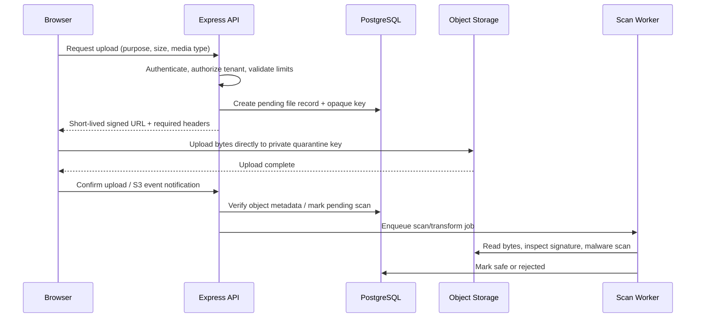

# Module 9 — Streams, uploads, outbound HTTP, webhooks, and realtime

[← Module 8](08-redis-cache-queues.md) · [Course home](../README.md) · Next: [Testing, API contracts and observability →](10-testing-contracts-observability.md)

## Concept — move bytes incrementally, not all at once

A **Buffer** is a byte sequence. A **Readable** produces chunks; a **Writable** consumes them; a **Duplex** both reads and writes; a **Transform** reads and emits transformed chunks. `pipeline()` connects stages, propagates errors and tears down resources. Web Streams (`ReadableStream`, `WritableStream`, `TransformStream`) use a separate standard API; Node provides adapters to interoperate.

Backpressure occurs when producer speed exceeds consumer speed. If a fast file reader continuously pushes data into a slow client, memory grows. Respect stream flow control, use `pipeline`, and cancel work when the client disconnects.

```text
file/db cursor → Readable → Transform (CSV/JSON encoding) → HTTP Writable
                       producer faster? pause/await drain (backpressure)
```

### Stream a file instead of buffering it

```ts
import { createReadStream } from "node:fs";
import { pipeline } from "node:stream/promises";
import type { RequestHandler } from "express";
import { resolve } from "node:path";

const exportFile: RequestHandler = async (req, res) => {
  const safeName = validateExportName(req.params.name); // allowlist, never path-join raw user input
  const path = resolve(exportRoot, safeName);
  res.status(200).type("text/csv; charset=utf-8");
  res.setHeader("Content-Disposition", 'attachment; filename="export.csv"');
  await pipeline(createReadStream(path), res);
};
```

In production, authorize the export, prevent path traversal using a fixed root/opaque ID, set content disposition safely, handle client disconnect, and stream from a DB cursor/object storage rather than assembling an unbounded file. For a response stream, once headers are sent an error usually means terminate the connection and log the request ID; do not try to send a second JSON response.

## Modern outbound HTTP: native `fetch`

Node's built-in `fetch` is promise-based and accepts standard web API objects. It does **not** reject just because an HTTP response is 404/500; check `response.ok`. Use an abort deadline, validate response content type/shape, limit response bytes, and apply a bounded retry only if the operation is safe.

```ts
const response = await fetch(inventoryUrl, {
  method: "GET",
  headers: { accept: "application/json", authorization: `Bearer ${serviceToken}` },
  signal: AbortSignal.timeout(1_500),
});

if (!response.ok) {
  throw new UpstreamError("Inventory service returned a non-success status", {
    status: response.status,
  });
}
const raw: unknown = await response.json();
const inventory = inventoryResponseSchema.parse(raw);
```

Never interpolate a user-supplied URL into server-side `fetch` without SSRF controls. Validate destination scheme/host, block private/link-local/metadata addresses, re-check redirects and DNS resolution, use an egress allowlist where possible, set a timeout, and cap response size. An initial public DNS answer can redirect/resolve differently later; SSRF defenses require layered network controls. Axios adds interceptors, adapters, and convenience behavior; native fetch is sufficient for many Node services. Do not add Axios automatically.

### Retry policy sketch

```ts
async function fetchWithRetry(url: URL, signal: AbortSignal) {
  const maxAttempts = 3;
  for (let attempt = 0; attempt < maxAttempts; attempt++) {
    try {
      const response = await fetch(url, { signal });
      if (response.status < 500 && response.status !== 429) return response;
      if (attempt === maxAttempts - 1) return response;
    } catch (error) {
      if (signal.aborted || attempt === maxAttempts - 1) throw error;
    }
    const base = 100 * 2 ** attempt;
    const jitter = Math.random() * base * 0.3;
    await new Promise((resolve) => setTimeout(resolve, base + jitter));
  }
  throw new Error("unreachable");
}
```

This pattern is intentionally incomplete: only call it for safe/idempotent work; respect `Retry-After`; propagate a total deadline; classify permanent errors; bound response bodies; and avoid retrying POST without an idempotency key. Use a shared retry budget and circuit breaker for frequently failing dependencies.

## Secure file upload architecture

### Small application upload path

```text
Browser → Express multipart parser with strict size/file-count limits
        → extension + declared MIME + magic-byte checks
        → quarantine/object storage → malware scan → authorized availability
```

MIME and extension alone are client-controlled and insufficient. Check content signatures (magic bytes), expected dimensions/format, archive expansion limits and filenames. Generate server-side object keys; store outside the webroot; default to private; authorize downloads; scan/quarantine before public availability; record ownership/tenant. Enforce limits at proxy, HTTP parser, app, and storage policy. Avoid trusting the user filename as a local path.

### Signed upload URL architecture



Signed URLs should be short-lived, limited to one key/verb/content length/content type as the provider permits, and treated as bearer credentials. The API must verify that the object exists and belongs to the requesting tenant; browser success does not prove a safe file. Local disk is for local development, not durable container production storage.

## Webhooks: verify raw bytes, then deduplicate

```text
Provider → POST raw bytes → verify provider signature/timestamp
         → unique provider event ID → transaction → outbox → 2xx
```

Mount a raw parser before JSON parsing on only the webhook route. Signature canonicalization is provider-specific; follow its official SDK/docs. HMAC comparison must be constant time and same length. Enforce timestamp/replay window where provider protocol supports it, and persist event IDs with a unique constraint. Acknowledge promptly after durable acceptance; do processing asynchronously. Webhooks may be duplicated, reordered, delayed or retried.

```ts
import { createHmac, timingSafeEqual } from "node:crypto";
import express from "express";

app.post("/api/v1/webhooks/payment",
  express.raw({ type: "application/json", limit: "256kb" }),
  async (req, res) => {
    const signatureHeader = req.get("provider-signature");
    if (!signatureHeader || !Buffer.isBuffer(req.body)) {
      res.sendStatus(400);
      return;
    }

    const expected = createHmac("sha256", config.paymentWebhookSecret)
      .update(req.body)
      .digest();
    const supplied = parseProviderSignature(signatureHeader); // provider-defined format
    if (supplied.length !== expected.length || !timingSafeEqual(supplied, expected)) {
      res.sendStatus(401);
      return;
    }

    const event = paymentEventSchema.parse(JSON.parse(req.body.toString("utf8")));
    // Transaction: INSERT provider_event_id with unique constraint + state transition + outbox.
    // Duplicate event ID: acknowledge success without applying side effect twice.
    await paymentWebhookService.accept(event, req.body);
    res.sendStatus(204);
  },
);
```

Do not compare decoded/trimmed JSON; provider signatures usually cover exact bytes. Ensure the route's raw parser runs before a general JSON parser would consume the stream. Do not log full payload/signature.

## Email architecture

Email is an external dependency with delays, quota, bounce/complaint behavior and secrets. Queue verification/reset/receipt mail after durable state changes. Keep provider API keys server-side; use templates with escaped untrusted values; set short one-time links; avoid placing passwords or sensitive financial data in message bodies. Record a durable delivery state and retry transient errors with bounds. Separate transactional email from bulk marketing/unsubscribe compliance requirements.

## SSE vs WebSocket vs polling

| Option | Good fit | Tradeoffs |
|---|---|---|
| Polling | Simple low-rate status checks | Repeated requests and latency; easiest load balancer behavior |
| Server-Sent Events (SSE) | Server-to-browser one-way updates, notifications, progress | HTTP response stays open; reconnect/Last-Event-ID behavior; browser EventSource auth/CORS limitations |
| WebSocket | Bidirectional low-latency interaction | Upgrade/auth/origin/message limits, heartbeats, reconnect state and multi-node fanout are app responsibilities |

### SSE example

```ts
app.get("/api/v1/notifications/stream", requireAuthentication, (req, res) => {
  const principal = req.principal;
  if (!principal) { res.sendStatus(401); return; }

  res.status(200).set({
    "Content-Type": "text/event-stream; charset=utf-8",
    "Cache-Control": "no-cache, no-transform",
    Connection: "keep-alive",
  });
  res.flushHeaders();
  res.write(`event: ready\ndata: {"requestId":"${req.requestId}"}\n\n`);

  const heartbeat = setInterval(() => res.write(": keepalive\n\n"), 20_000);
  const unsubscribe = notificationHub.subscribe(principal.userId, (notification) => {
    res.write(`id: ${notification.id}\nevent: notification\ndata: ${JSON.stringify(notification)}\n\n`);
  });

  res.on("close", () => {
    clearInterval(heartbeat);
    unsubscribe();
  });
});
```

This is a teaching sketch: a real implementation must use safe serialization/escaping and event IDs; check session revalidation, per-user limits, heartbeat and proxy idle timeout. For cookie auth, same-origin EventSource is simplest. Native EventSource cannot set arbitrary Authorization headers in its classic browser API, so choose cookie auth or a carefully scoped short-lived stream token.

### WebSocket handshake and security

A WebSocket starts with an HTTP upgrade request and then exchanges frames over a persistent connection. With `ws`, attach a `WebSocketServer` to Node's HTTP server and explicitly authenticate/authorize the upgrade, validate browser `Origin`, set `maxPayload`, rate-limit connections/messages, validate every message schema, handle ping/pong, and close on logout/session revocation. Do not trust room names supplied by a client; authorize each subscription.

```ts
import { createServer } from "node:http";
import { WebSocket, WebSocketServer } from "ws";
import type { Principal } from "./principal.js";

const server = createServer(app);
const wss = new WebSocketServer({ noServer: true, maxPayload: 64 * 1024 });
const principals = new WeakMap<WebSocket, Principal>();

server.on("upgrade", async (request, socket, head) => {
  try {
    if (!isAllowedOrigin(request.headers.origin)) throw new Error("origin rejected");
    const principal = await authenticateUpgradeCookie(request.headers.cookie);
    if (!principal) throw new Error("unauthorized");
    wss.handleUpgrade(request, socket, head, (ws) => {
      principals.set(ws, principal);
      wss.emit("connection", ws, request); // standard ws event arguments only
    });
  } catch {
    socket.write("HTTP/1.1 401 Unauthorized\r\n\r\n");
    socket.destroy();
  }
});
```

The snippet is deliberately incomplete: use the `principals` WeakMap (or a typed connection wrapper) inside the event handler, guard socket lifecycle/timeouts, avoid leaking auth reason, and close the socket on authorization failure. The key design point is auth and origin validation before `handleUpgrade`.

### Scaling realtime

With multiple API instances, in-process subscribers only see local connections. Use a shared broker (Redis Pub/Sub/Streams or another message system) for fanout; pub/sub is ephemeral, while durable notifications need a DB event/history plus cursor. Load balancer stickiness can keep a connection on one server but does not distribute events. Track connection count and memory, apply per-user connection caps, and plan reconnect jitter/resubscription.

## Common mistakes

- Buffering a large upload/export entirely into memory.
- `pipe()` without complete error/cleanup/cancellation handling.
- Retrying arbitrary POST requests or ignoring `Retry-After`.
- SSRF through user-controlled URL or unsafe redirects.
- Treating extension/content-type as proof of file safety.
- Verifying webhook signature after parsing/normalizing JSON.
- Responding 200 before a webhook event is durably recorded.
- Using a long-lived signed upload URL as permanent authorization.
- SSE/WebSocket handler leaks listeners/timers after disconnect.
- Assuming a local memory pub/sub hub works across API replicas.

## Exercises

- **Beginner:** write a stream pipeline from file to a checksum and explain backpressure.
- **Intermediate:** build a webhook verifier for a documented test signature; test altered bytes, invalid length, stale timestamp and duplicate event ID.
- **Production:** design a private signed-upload flow with tenant record, quarantine, scanning, retention and authorized download.
- **Debugging:** simulate a browser disconnect during a large export; prove file/database resources are released.
- **Architecture:** choose SSE, WebSocket or polling for admin notifications and report progress; design auth, reconnect, durable event history and multi-instance fanout.

## Build this yourself before looking at a solution

Implement an object-storage upload lifecycle and payment webhook acceptance flow. Do not build production storage integrations until the provider is chosen; first specify signed URL restrictions, scanner boundary, event dedupe and failure state. **Expected architecture:** bytes stream, file is private until scanned, webhook durable acceptance is idempotent, email/reports are asynchronous. **Review:** check every key/URL/token for expiry, tenant binding, limits and safe logging.

## Official documentation

- [Node streams](https://nodejs.org/docs/latest-v24.x/api/stream.html) · [Web Streams](https://nodejs.org/docs/latest-v24.x/api/webstreams.html) · [Buffer](https://nodejs.org/docs/latest-v24.x/api/buffer.html) · [fetch / globals](https://nodejs.org/docs/latest-v24.x/api/globals.html)
- [Node HTTP upgrade](https://nodejs.org/docs/latest-v24.x/api/http.html#event-upgrade) · [Node crypto HMAC](https://nodejs.org/docs/latest-v24.x/api/crypto.html) · [Node abort signals](https://nodejs.org/docs/latest-v24.x/api/globals.html#class-abortsignal)
- [Express body parsers](https://expressjs.com/en/5x/api.html#express.json) · [Multer multipart parser](https://github.com/expressjs/multer) · [ws API](https://github.com/websockets/ws) · [OWASP File Upload Cheat Sheet](https://cheatsheetseries.owasp.org/cheatsheets/File_Upload_Cheat_Sheet.html)
- Consult the selected object-storage, payment-provider and email-provider official docs for signing, verification, retries and limits before integrating them.

## What I should know before continuing

You can explain stream backpressure, use native fetch with deadline and runtime validation, design secure file handling and signed uploads, verify webhook bytes before parsing, make webhook acceptance idempotent, and choose SSE/WebSockets based on directionality and scaling constraints. Next: [Module 10 — testing, contracts and observability](10-testing-contracts-observability.md).
