# Architecture reference — required sequence diagrams

These diagrams are learning reference diagrams for the capstone. They show one reasonable flow, not a claim that every product must use exactly this design. Always revisit atomicity, retries, authorization and failure behavior for your system.

## HTTP request / lifecycle

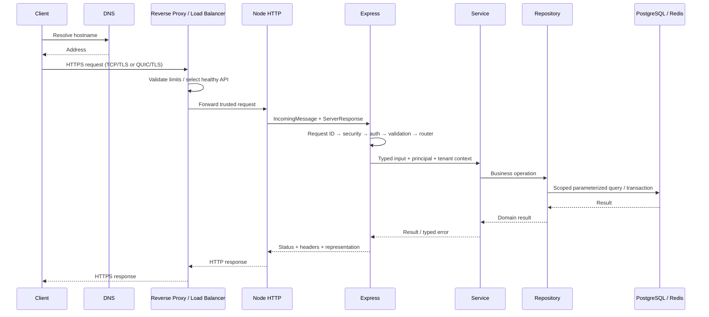

## Express middleware control flow

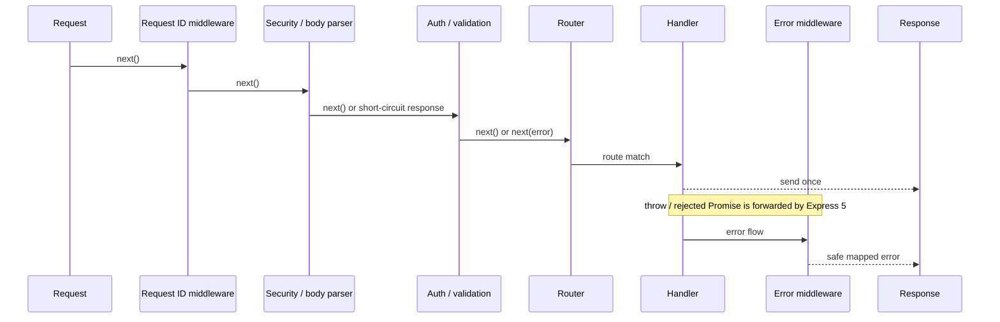

## Login

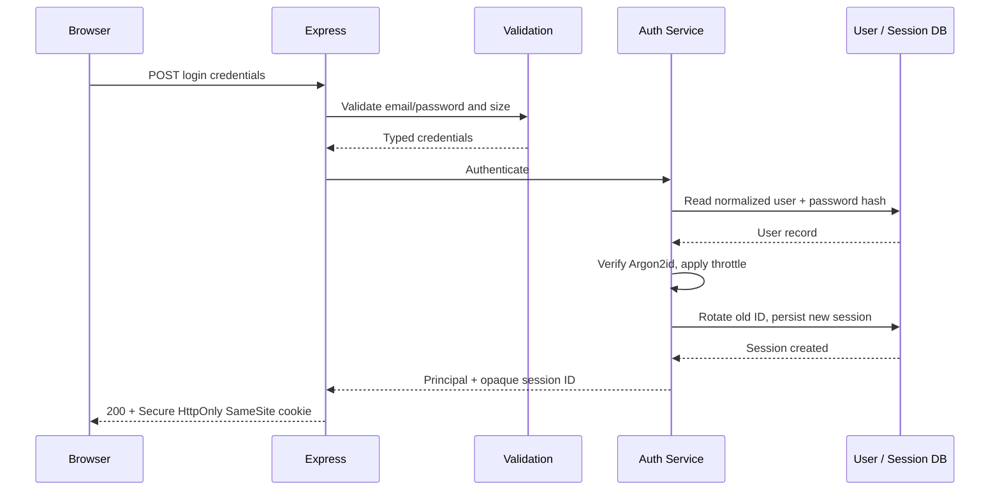

## Refresh token rotation (JWT alternative)

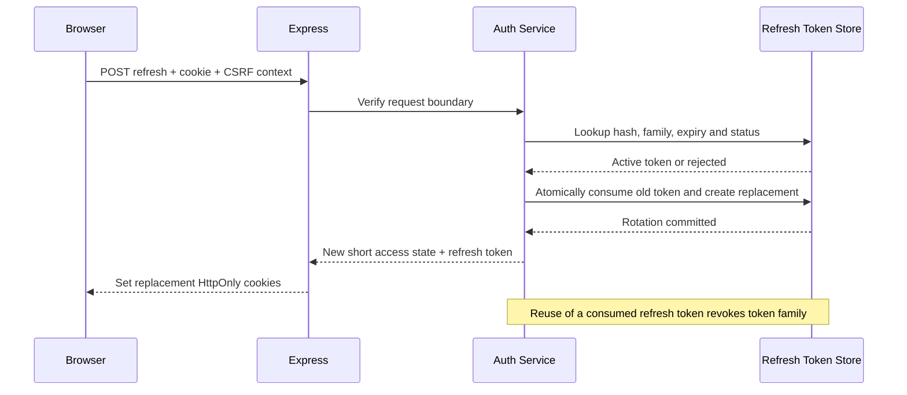

## Logout and revocation

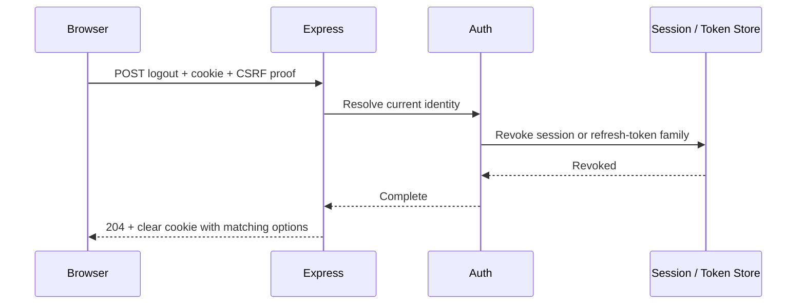

## Authorization

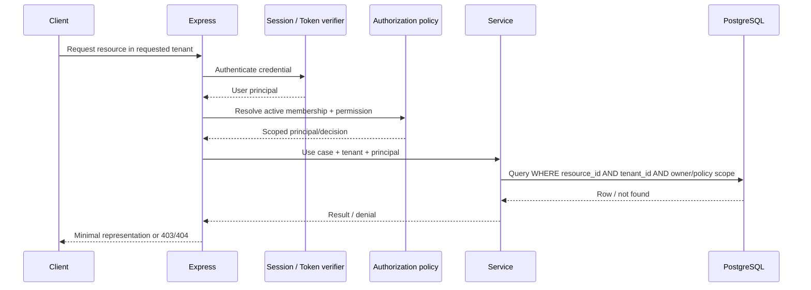

## Database transaction (order + inventory + payment intent)

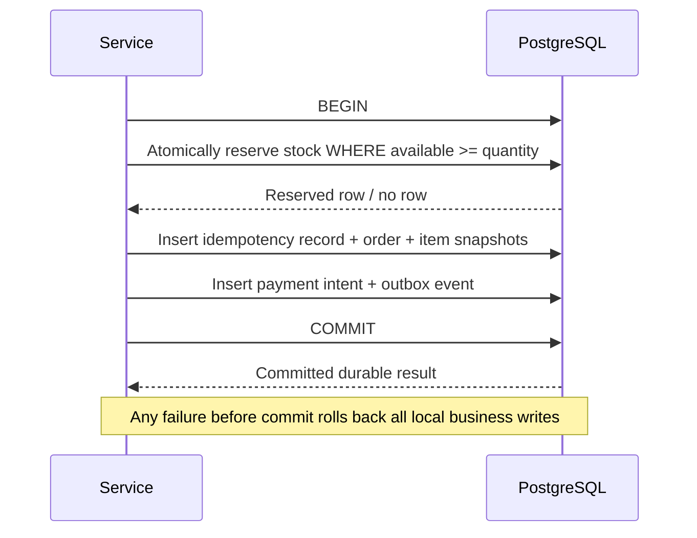

## Cache-aside read

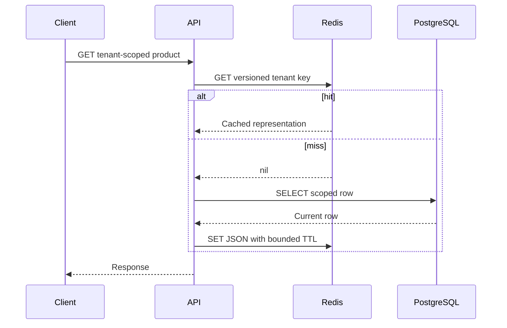

## Cache invalidation after write

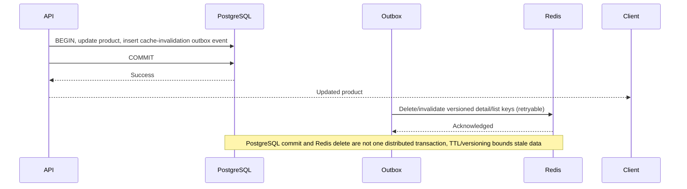

## Queue + worker

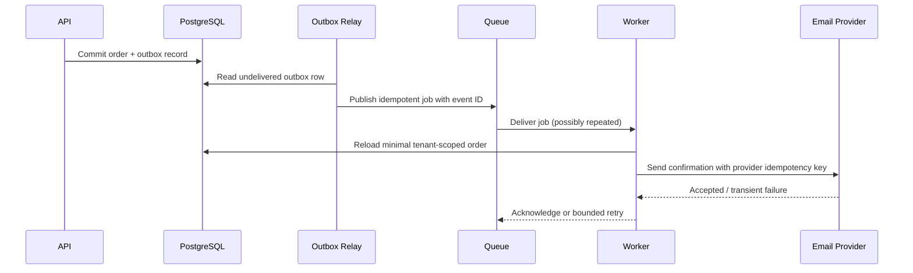

## Webhook verification and idempotency

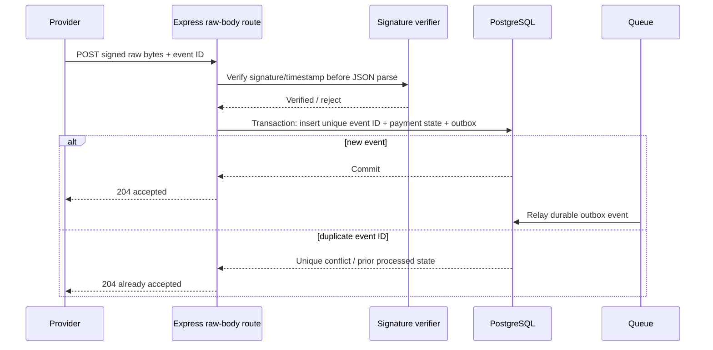

## Payment request idempotency

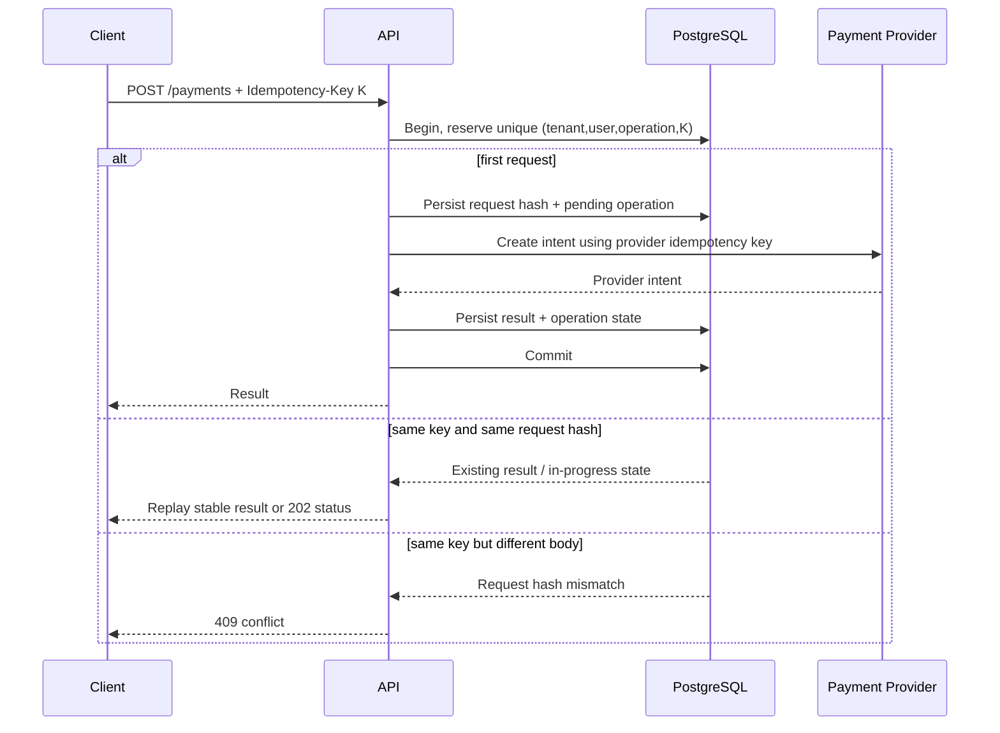

Do not hold a DB transaction open around a slow provider call in a real implementation. The diagram is conceptual: model an explicit pending state and durable reconciliation/outbox workflow while preserving unique idempotency reservation and provider dedupe.

## File upload with signed URL

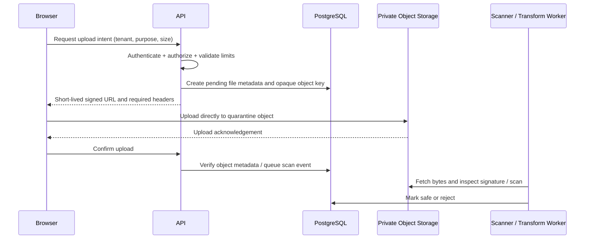

## WebSocket connection

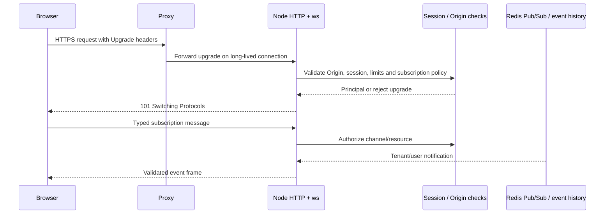

## Server-Sent Events

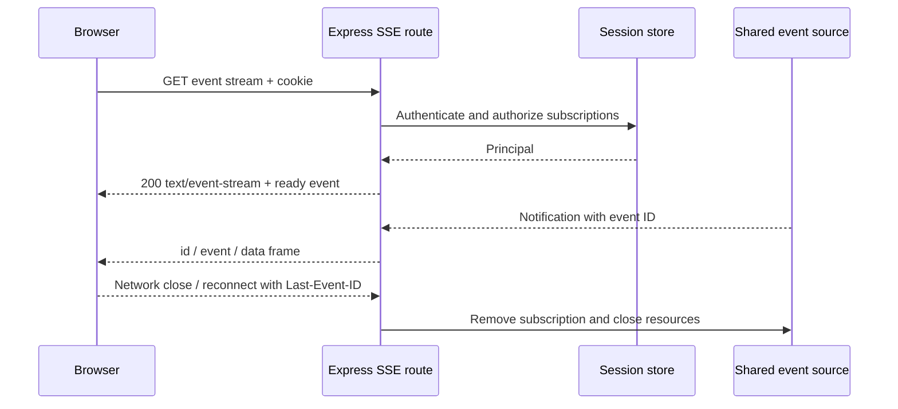

## Graceful shutdown

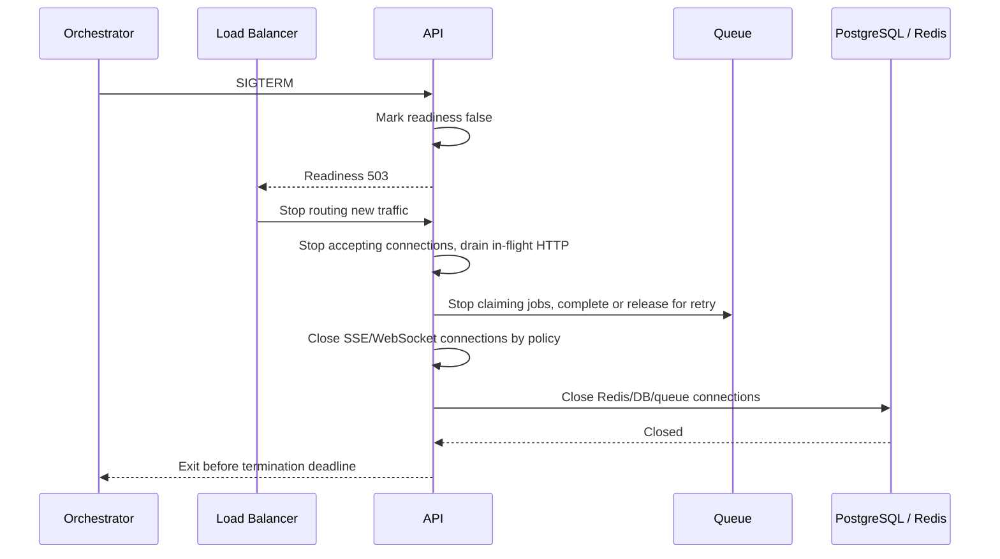

## Deployment topology

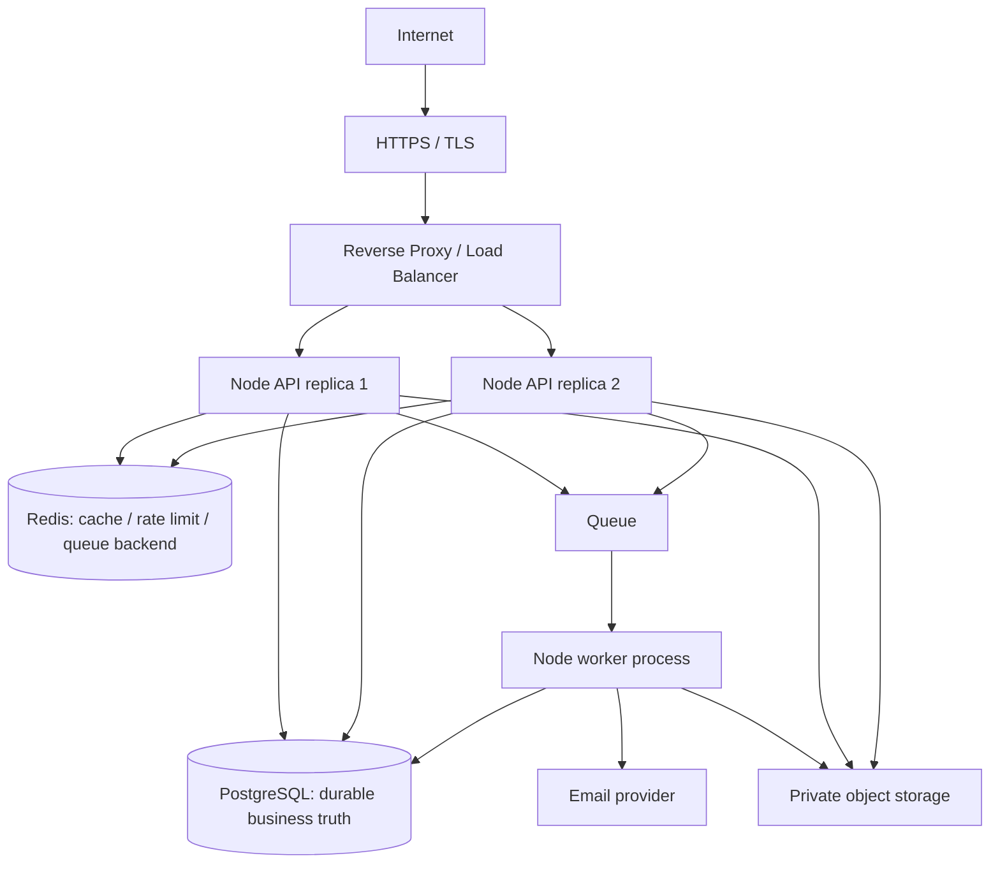

## Shutdown and deployment review questions

Does the proxy's drain window exceed API/worker shutdown time? Can clients retry safely? Does a job lease recover after process kill? Are websockets reconnected with jitter? Can a worker publish the same outbox event twice? Are Redis/PostgreSQL shared state policies correct across replicas? Is every service observable and its secret/network scope minimized?
